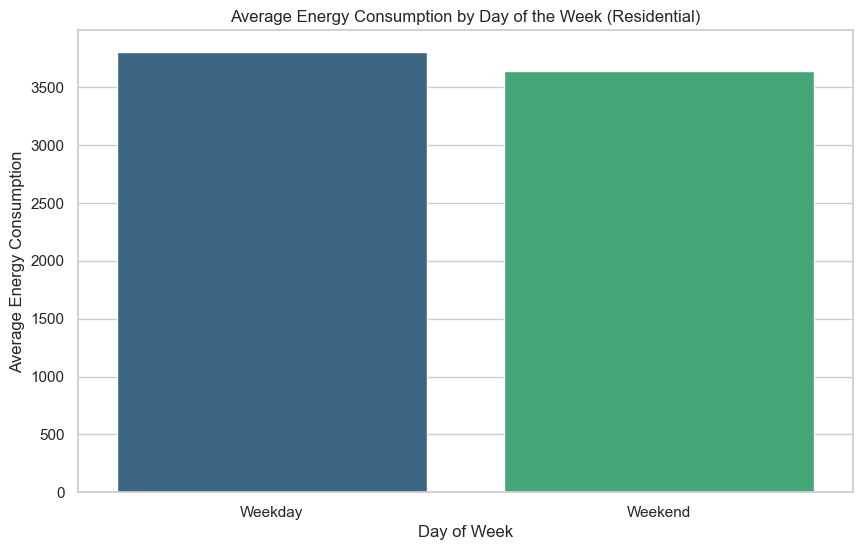

# Energy Consumption Analysis for Residential Buildings

This repository contains the analysis and visualizations of energy consumption patterns in residential buildings based on a dataset from Kaggle. The analysis explores how factors such as square footage, number of occupants, appliances used, average temperature, and day of the week influence energy consumption. The visualizations were created using **Seaborn** and **Matplotlib**.

## Key Findings

### 1. Pairplot Analysis.
The pairplot below shows the relationships between energy consumption and various factors such as square footage, number of occupants, appliances used, and average temperature.

- **Square Footage vs Energy Consumption**: Larger buildings tend to consume more energy, but the relationship is not strictly linear. Some smaller buildings also show high energy consumption, possibly due to factors like occupancy or appliance usage.
- **Number of Occupants vs Energy Consumption**: Higher occupancy correlates with increased energy consumption.
- **Appliances Used vs Energy Consumption**: Buildings with more appliances consume more energy.
- **Average Temperature vs Energy Consumption**: Energy consumption increases in extreme temperatures (both high and low).
- **Day of the Week**: Energy consumption varies slightly between weekdays and weekends, with weekends showing slightly higher consumption.


### 2. Boxplot: Energy Consumption by Day of the Week
- **Weekdays vs Weekends**: Energy consumption is slightly higher on weekends, likely due to increased occupancy and appliance usage.
- **Variability**: Weekdays show more consistent energy consumption, while weekends have a wider range of usage patterns.
  
  

### 3. Scatterplot: Energy Consumption vs Square Footage
- **Square Footage Impact**: Larger buildings generally consume more energy, but there are outliers where smaller buildings consume disproportionately high energy.
- **Number of Occupants**: Buildings with more occupants tend to consume more energy.
- **Appliances Used**: Buildings with more appliances consume more energy, even if the square footage is smaller.


### 4. Heatmap: Correlation Between Variables
- **Square Footage and Energy Consumption**: Moderate positive correlation.
- **Number of Occupants and Energy Consumption**: Moderate positive correlation.
- **Appliances Used and Energy Consumption**: Strong positive correlation.
- **Average Temperature**: Weaker correlation with energy consumption.
- **Day of the Week**: No significant correlation with energy consumption.
  


### 5. Barplot: Average Energy Consumption by Day of the Week
- **Weekend Consumption**: Slightly higher average energy consumption on weekends.
- **Weekday Consumption**: Lower and more consistent, likely due to predictable routines.

  

## Insights and Recommendations
1. **Energy Efficiency in Larger Buildings**: Potential for energy savings through efficient HVAC systems, insulation, and smart energy management.
2. **Occupancy and Appliance Usage**: Encourage energy-efficient appliances and educate residents on energy-saving practices.
3. **Temperature Management**: Implement better insulation and programmable thermostats to mitigate energy spikes during extreme temperatures.
4. **Weekend Energy Usage**: Consider time-of-use energy pricing or incentives for off-peak usage to balance energy demand.
5. **Outliers in Smaller Buildings**: Investigate smaller buildings with high energy consumption for inefficiencies.

## Conclusion
The analysis reveals that energy consumption in residential buildings is influenced by multiple factors, including square footage, number of occupants, appliances used, and average temperature. There are opportunities for energy savings through efficiency improvements and behavioral changes.

## Next Steps
- Conduct a deeper analysis of outliers (e.g., small buildings with high energy consumption) to identify inefficiencies.
- Explore the impact of specific appliances on energy consumption.
- Investigate the potential for renewable energy integration (e.g., solar panels) to reduce reliance on grid energy.
- Develop targeted energy-saving programs for residents, focusing on appliance usage and temperature control.

## Dataset Attribution
This project uses the dataset **[Energy Consumption Dataset - Linear Regression](https://www.kaggle.com/datasets/govindaramsriram/energy-consumption-dataset-linear-regression)** by [GOVINDARAM SRIRAM](https://www.kaggle.com/govindaramsriram), licensed under [CC BY 4.0](https://creativecommons.org/licenses/by/4.0/).

## Requirements
- Python 3.x
- Libraries: Pandas, Seaborn, Matplotlib

## Installation
To run the analysis, clone this repository and install the required libraries:

```bash
git clone https://github.com/yourusername/energy-consumption-analysis.git
cd energy-consumption-analysis
pip install -r requirements.txt
